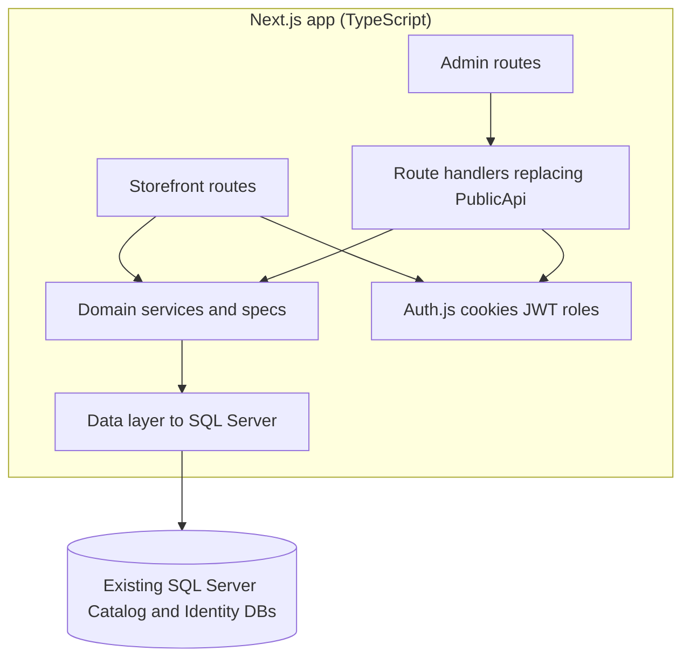
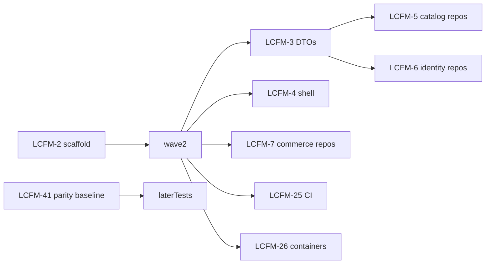

# Migrate eShopOnWeb from .NET to Next.js

Rewrite the ASP.NET Core solution under `src/` into one Next.js App Router + TypeScript app. End state is **zero .NET**. SQL Server stays for the first cutover; PostgreSQL is follow-up work.

Jira epic: [LCFM-1](https://fe-anysphere-demo.atlassian.net/browse/LCFM-1)

Stage exit criteria: [migration-stage-gates.md](./migration-stage-gates.md)

## Target architecture

## Principles

- Preserve observable behavior from the current tests: catalog filters/pagination, cookie basket (`eShop`) with login merge, auth-gated checkout/orders, demo accounts/roles, and Playwright-visible strings (`[ ADD TO BASKET ]`, `Basket`, `- Microsoft.eShopOnWeb`).
- Keep the existing SQL Server schema and seed data through cutover.
- Land shared contracts first. Feature work runs in parallel after those land.
- Delete .NET only after parity is verified.
- Bugbot reviews diffs; CI runs tests. See `.cursor/BUGBOT.md` and [LCFM-36](https://fe-anysphere-demo.atlassian.net/browse/LCFM-36).

## What to start with

1. [LCFM-2](https://fe-anysphere-demo.atlassian.net/browse/LCFM-2) — Next.js scaffold (blocks most later work)
2. [LCFM-41](https://fe-anysphere-demo.atlassian.net/browse/LCFM-41) — .NET parity baseline (can run in parallel with LCFM-2)

After LCFM-2: LCFM-3, LCFM-4, LCFM-7, LCFM-25, LCFM-26. After LCFM-2 and LCFM-3: LCFM-5 and LCFM-6.

## Ticket map

Original plan IDs are listed only as a crosswalk. Work from the LCFM keys.

### Foundation

| Plan ID | Ticket | Summary |
| --- | --- | --- |
| F1 | [LCFM-2](https://fe-anysphere-demo.atlassian.net/browse/LCFM-2) | Minimal Next.js TypeScript and Vitest scaffold |
| F5 | [LCFM-3](https://fe-anysphere-demo.atlassian.net/browse/LCFM-3) | Shared API DTOs and authorization constants |
| F1 UI | [LCFM-4](https://fe-anysphere-demo.atlassian.net/browse/LCFM-4) | Application shell and static assets |
| F2 catalog | [LCFM-5](https://fe-anysphere-demo.atlassian.net/browse/LCFM-5) | Catalog SQL Server models and repositories |
| F2 identity | [LCFM-6](https://fe-anysphere-demo.atlassian.net/browse/LCFM-6) | Identity SQL Server models and repositories |
| F2 commerce | [LCFM-7](https://fe-anysphere-demo.atlassian.net/browse/LCFM-7) | Basket and order SQL Server models and repositories |
| F3 catalog | [LCFM-8](https://fe-anysphere-demo.atlassian.net/browse/LCFM-8) | Catalog filtering and paging domain |
| F3 basket | [LCFM-9](https://fe-anysphere-demo.atlassian.net/browse/LCFM-9) | Basket aggregate and service |
| F3 orders | [LCFM-10](https://fe-anysphere-demo.atlassian.net/browse/LCFM-10) | Order aggregate and checkout service |
| F4 | [LCFM-11](https://fe-anysphere-demo.atlassian.net/browse/LCFM-11) | Auth.js credential sessions and role authorization |

### Storefront

| Plan ID | Ticket | Summary |
| --- | --- | --- |
| S1 | [LCFM-12](https://fe-anysphere-demo.atlassian.net/browse/LCFM-12) | Catalog storefront with filters and pagination |
| S2 | [LCFM-13](https://fe-anysphere-demo.atlassian.net/browse/LCFM-13) | Anonymous basket page and mutations |
| S2 merge | [LCFM-14](https://fe-anysphere-demo.atlassian.net/browse/LCFM-14) | Transfer anonymous basket after login |
| S3 checkout | [LCFM-15](https://fe-anysphere-demo.atlassian.net/browse/LCFM-15) | Authenticated checkout and success |
| S3 orders | [LCFM-16](https://fe-anysphere-demo.atlassian.net/browse/LCFM-16) | Order history and detail |
| S4 | [LCFM-17](https://fe-anysphere-demo.atlassian.net/browse/LCFM-17) | Login, registration, and logout |
| S4 profile | [LCFM-18](https://fe-anysphere-demo.atlassian.net/browse/LCFM-18) | Account profile and password management |
| S5 OAuth | [LCFM-19](https://fe-anysphere-demo.atlassian.net/browse/LCFM-19) | Optional GitHub OAuth |
| S5 2FA | [LCFM-20](https://fe-anysphere-demo.atlassian.net/browse/LCFM-20) | Two-factor authentication |

### Admin and API

| Plan ID | Ticket | Summary |
| --- | --- | --- |
| X1 catalog | [LCFM-21](https://fe-anysphere-demo.atlassian.net/browse/LCFM-21) | Catalog PublicApi replacement |
| X1 identity | [LCFM-22](https://fe-anysphere-demo.atlassian.net/browse/LCFM-22) | User, role, and auth PublicApi replacement |
| A1 catalog | [LCFM-23](https://fe-anysphere-demo.atlassian.net/browse/LCFM-23) | Catalog administration UI |
| A1 users | [LCFM-24](https://fe-anysphere-demo.atlassian.net/browse/LCFM-24) | User and role administration UI |

### Platform

| Plan ID | Ticket | Summary |
| --- | --- | --- |
| X3 CI | [LCFM-25](https://fe-anysphere-demo.atlassian.net/browse/LCFM-25) | Next.js CI build and quality gates |
| X3 docker | [LCFM-26](https://fe-anysphere-demo.atlassian.net/browse/LCFM-26) | Next.js container and SQL Server compose — see [docker-local-nextjs.md](./docker-local-nextjs.md) |
| X3 azure | [LCFM-27](https://fe-anysphere-demo.atlassian.net/browse/LCFM-27) | Azure deployment for Next.js + SQL Server |
| X2 | [LCFM-28](https://fe-anysphere-demo.atlassian.net/browse/LCFM-28) | Playwright parity suite |
| X3 o11y | [LCFM-29](https://fe-anysphere-demo.atlassian.net/browse/LCFM-29) | Health checks, logging, and telemetry |

### Cutover and PostgreSQL follow-up

| Plan ID | Ticket | Summary |
| --- | --- | --- |
| C1 | [LCFM-30](https://fe-anysphere-demo.atlassian.net/browse/LCFM-30) | Cut over to Next.js and remove .NET |
| P1 schema | [LCFM-31](https://fe-anysphere-demo.atlassian.net/browse/LCFM-31) | PostgreSQL schema and provider transition |
| P1 data | [LCFM-32](https://fe-anysphere-demo.atlassian.net/browse/LCFM-32) | SQL Server to PostgreSQL data migration tooling |
| P2 | [LCFM-33](https://fe-anysphere-demo.atlassian.net/browse/LCFM-33) | Provision PostgreSQL and execute database cutover |

### Quality and validation

These were added so each stage can be tested instead of dumping all validation into LCFM-28.

| Ticket | Summary | Notes |
| --- | --- | --- |
| [LCFM-34](https://fe-anysphere-demo.atlassian.net/browse/LCFM-34) | PR template | Implemented in the quality-gates PR |
| [LCFM-35](https://fe-anysphere-demo.atlassian.net/browse/LCFM-35) | Bugbot review rules | Implemented in the quality-gates PR |
| [LCFM-36](https://fe-anysphere-demo.atlassian.net/browse/LCFM-36) | Require CI and Bugbot for merge | GitHub branch protection; wait for LCFM-25 |
| [LCFM-37](https://fe-anysphere-demo.atlassian.net/browse/LCFM-37) | Stage exit gates doc | Implemented in the quality-gates PR |
| [LCFM-38](https://fe-anysphere-demo.atlassian.net/browse/LCFM-38) | Auth compatibility and security tests | |
| [LCFM-39](https://fe-anysphere-demo.atlassian.net/browse/LCFM-39) | API differential harness | Blocked by LCFM-41, LCFM-21, LCFM-22, LCFM-42 |
| [LCFM-40](https://fe-anysphere-demo.atlassian.net/browse/LCFM-40) | Performance baselines | |
| [LCFM-41](https://fe-anysphere-demo.atlassian.net/browse/LCFM-41) | .NET behavioral parity baseline | Can start now |
| [LCFM-42](https://fe-anysphere-demo.atlassian.net/browse/LCFM-42) | Shared test fixtures and seed | Blocked by LCFM-2 |
| [LCFM-43](https://fe-anysphere-demo.atlassian.net/browse/LCFM-43) | SQL Server compatibility tests | |
| [LCFM-44](https://fe-anysphere-demo.atlassian.net/browse/LCFM-44) | Visual regression baselines | |

## Parallelism

Largest later parallel batch: catalog, basket, accounts, admin, API, tests, and DevOps.

Sequential tail: LCFM-30 cutover, then LCFM-31, LCFM-32, LCFM-33.

## Out of scope for the first cutover

- PostgreSQL (LCFM-31 through LCFM-33)
- New product features beyond current behavior
- Inventing mappings or changing checkout/payment semantics
